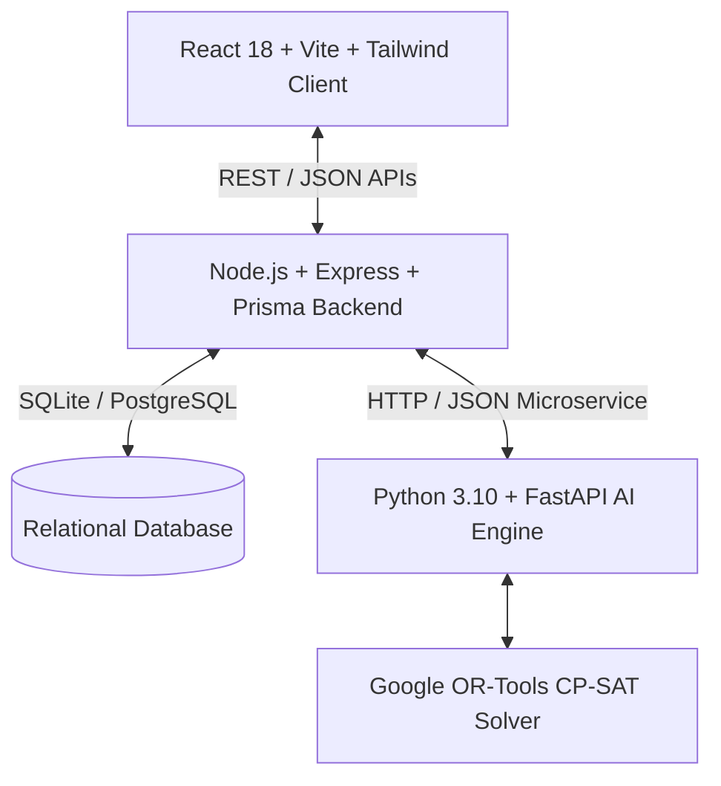

# System Architecture - AI Timetable System (NEP 2020 Aligned)

## High-Level System Architecture

## Component Breakdown

1. **Client Tier (`/client`)**:
   - Modern React single-page application built with Vite and TypeScript.
   - Design System: Custom Tailwind CSS with dark/light mode and rich NEP course stream color badges.
   - Interactive Timetable Studio: Visual drag-and-drop schedule editing with real-time constraint validation.
   - Multi-role Dashboards: College Admin, Department Admin, HOD, Faculty, Student.

2. **Backend API Tier (`/server`)**:
   - Express REST API with TypeScript.
   - Security: JWT Authentication, Role-Based Access Control (RBAC), Helmet, CORS protection, Rate limiting.
   - ORM: Prisma schema mapping normalized tables.
   - Proxy Service: Communication with Python AI engine with embedded Node.js fallback solver.

3. **AI Engine Tier (`/ai-engine`)**:
   - Python FastAPI service wrapping Google OR-Tools CP-SAT constraint solver.
   - Solves NP-hard university timetabling problems under NEP 2020 multidisciplinary constraints.
   - Workload analysis engine using Pandas and SciKit-Learn logic.
